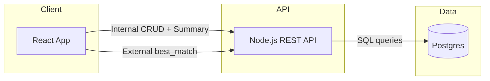

# Restaurant Insights App

Small full-stack demo showing internal restaurant data management and external matching via REST APIs and Postgres.

## How to run

### Backend
1. Create Postgres DB and run schema:
   ```bash
   createdb restaurant_insights
   psql -d restaurant_insights -f backend/sql/schema.sql
   ```
2. Configure env:
   ```bash
   cp backend/.env.example backend/.env
   ```
3. Install and run:
   ```bash
   cd backend
   npm install
   npm run dev
   ```

### Frontend
1. Configure env:
   ```bash
   cp frontend/.env.example frontend/.env
   ```
2. Install and run:
   ```bash
   cd frontend
   npm install
   npm run dev
   ```

## Internal vs external flows
- **Internal (staff)**: create/edit restaurants, filter/sort lists, view summaries. Uses `x-api-key`.
- **External (customer)**: submit location + attributes, get ranked matches with explanations. Public and read-only.

## API endpoints

### Internal (authenticated)
- `POST /restaurants` create restaurant
- `PUT /restaurants/:id` update restaurant
- `GET /restaurants` list with filters: `cuisine`, `city`, `state`, `min_rating`, `sort`
- `GET /restaurants/summary` aggregates: count by cuisine, avg rating by city

### External (public)
- `GET /best_match` location + attributes matching and ranking

#### /best_match response contract (stable)
```json
{
  "criteria": {
    "cuisine": "Thai",
    "price_range": "$$",
    "tags": ["patio"],
    "city": "Austin",
    "state": "TX",
    "latitude": 30.26,
    "longitude": -97.74,
    "radius_km": 25
  },
  "count": 2,
  "message": "Matches found.",
  "results": [
    {
      "id": 1,
      "name": "Example",
      "city": "Austin",
      "state": "TX",
      "latitude": 30.26,
      "longitude": -97.74,
      "cuisine": "Thai",
      "price_range": "$$",
      "tags": ["patio"],
      "rating": 4.6,
      "notes": null,
      "distance_km": 3.2,
      "score": 0.842,
      "explanation": "Cuisine matches • Price range matches • Tags matched: patio • Within 3.2 km • Rating 4.6"
    }
  ]
}
```

## Caching strategy
- `/best_match` uses React Query with a key derived from location + attributes.
- Cache TTL: 2 minutes; GC: 5 minutes.
- New search criteria produce a new query key and fetch.

## Assumptions and tradeoffs
- Shared API key is sufficient for internal auth.
- City/state or lat/lng are user-provided (no geocoding).
- Tags and cuisines are normalized in separate tables.
- Ranking uses a weighted blend of attribute match, distance, and rating.
- Single API service keeps logic centralized but can bottleneck at scale.

## Cloud architecture (design only)


## Limitations and future improvements
- No geocoding; users must enter city/state or coordinates.
- Distance filtering is done in the API layer; PostGIS would be more efficient.
- Limited server-side validation and no pagination for large datasets.
- No role-based auth or audit logs for internal actions.
